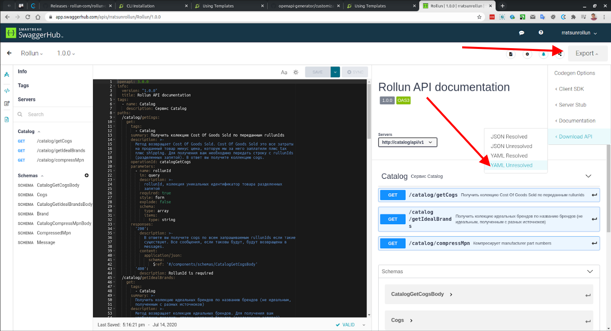

# OpenAPI generator

Библиотека, которая дает возможность подключить, сгенерированный OpenAPI генератором, серверный или клиентский код к вашему проекту. 

## Установка:
1. Установите [openapi-generator](https://openapi-generator.tech/) ниже 5й (не включительно). Для проверки выполните команду:

   ```openapi-generator version```, в случае когда openapi-generator установлен вы увидите версию генератора.

   **ВЕРСИЯ ГЕНЕРАТОРА ДОЛЖНА БЫТЬ НИЖЕ ПЯТОЙ.** Связанно это с тем что в 5й версии [убрали](https://github.com/OpenAPITools/openapi-generator/pull/8145/commits) 
   генератор которым мы пользуемся, ему изменили имя и переделали для Laminas вместо Zend.
   
2. Установите библиотеку, для этого выполните команду 

   ```composer require rollun-com/rollun-openapi```
   * **!!!ВАЖНО!!!** После того как композер отработает, проверьте чтобы в файле `/config/config.php` конфиг провайдер `\OpenAPI\ConfigProvider::class` загружался после `\Zend\Expressive\Router\FastRouteRouter\ConfigProvider::class` в ином случаем работать не будет.
   
   * **!!!ВАЖНО!!!** Для того чтобы не было проблем с инъекцией зависимостей вам нужно проверить чтобы LifeCycleToken был добавлен в контейнер до создания app. Проверьте это в /public/index.php. Пример правильного добавления LifeCycleToken:  
      ```php
      // Init lifecycle token
      $lifeCycleToken = LifeCycleToken::generateToken();
      if (LifeCycleToken::getAllHeaders() && array_key_exists("LifeCycleToken", LifeCycleToken::getAllHeaders())) {
          $lifeCycleToken->unserialize(LifeCycleToken::getAllHeaders()["LifeCycleToken"]);
      }
      $container->setService(LifeCycleToken::class, $lifeCycleToken);
      
      /** @var Application $app */
      $app = $container->get(Application::class); 
      ```     
3. Подготовьте openapi манифест. Детали [здесь](docs/manifest.md).       
4. Скачайте openapi манифест. Для этого перейдите на https://app.swaggerhub.com/home?type=API, откройте нужный вам манифест и сделайте экспорт в виде yaml файла. При скачивании, рекомендуется называть документ **openapi.yaml** так, как такое имя используется генератором по умолчанию.
   
5. Для генерации кода выполните команду:

   ```php vendor/bin/openapi-server-generate```
   
   или
   
   ```php vendor/bin/openapi-client-generate```

6. Обязательно добавьте сгенерированные классы в аутолоадер композера.
   ```
     "autoload": {
       "psr-4": {
         "SomeModule\\": "src/SomeModule/src/"
       }
     },
   ```
   
## Quick Start видео   
Для просмотра видео перейдите по [ссылке](https://drive.google.com/file/d/1kzuJMICC5P4kxlkRZE5UmDD1PwBFVerp/view?usp=sharing).

## Формат даты и времени
Формат даты и времени, согласно спецификации [OpenApi](https://swagger.io/docs/specification/data-models/data-types/) должен возвращаться
в формате [RFC 3339, section 5.6](https://tools.ietf.org/html/rfc3339#section-5.6). Примеры: "2017-07-21T17:32:28Z", "2020-12-11T15:04:02.255Z".
Важно заметить, что php формат `\DateTime::RFC3339 ('Y-m-d\TH:i:sP')` не в полной степени соответствует настоящему RFC 3339 формату, а именно
в php `\DateTime::RFC3339` не допускается Z в конце строки, а так же нету поддержки необязательных миллисекунд.

**На момент версии 2.0.0 миллисекунды не поддерживаются, валидация даты времени происходит за форматом `'Y-m-d\TH:i:s\Z'`**

## Помещать ли библиотеку в require-dev секцию?
Нет, почти все классы с этой библиотеки нужны для работы в продакшене: роутинг, сереализация дто и т.д.
Для генерации кода используются только команды из ./bin директории, шаблоны из template, а так же пакет ```nette/php-generator```.
Пока что эти зависимости остаются в пакете и подтягиваются в продакшн.