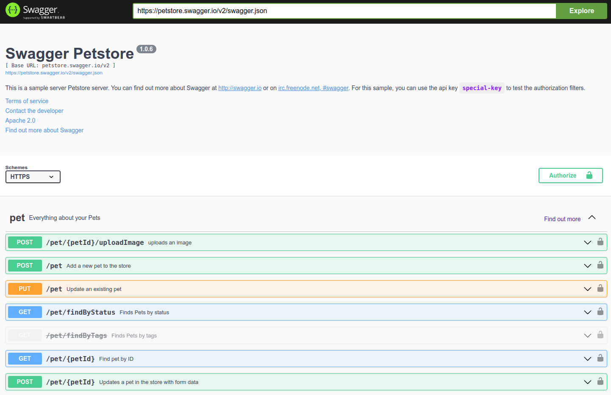
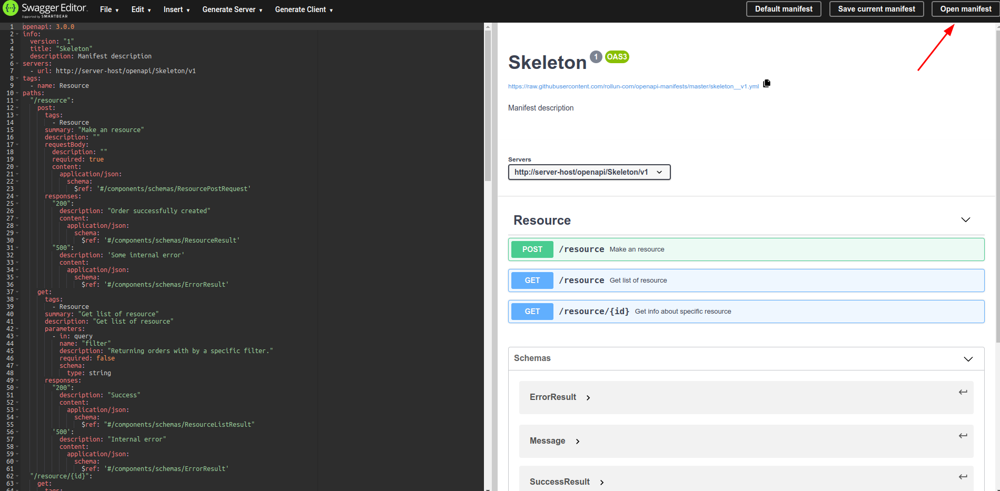
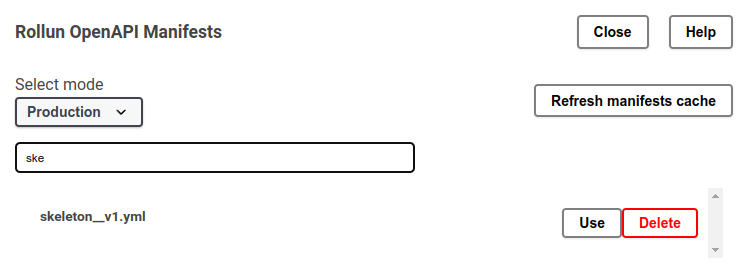

# Що таке openapi

Openapi - це формат файлу, який описує http API: формати запиту/відповіді та кінцеві точки.

Простий варіант openapi файлу, що описує api с однією кінцевою точкою `/users`, яка повертає массив імен користувачів,
виглядає наступним чином:

```yaml
openapi: 3.0.0
info:
  title: Sample API
  description: Optional multiline or single-line description in [CommonMark](http://commonmark.org/help/) or HTML.
  version: 0.1.9
servers:
  - url: http://api.example.com/v1
    description: Optional server description, e.g. Main (production) server
  - url: http://staging-api.example.com
    description: Optional server description, e.g. Internal staging server for testing
paths:
  /users:
    get:
      summary: Returns a list of users.
      description: Optional extended description in CommonMark or HTML.
      responses:
        '200':    # status code
          description: A JSON array of user names
          content:
            application/json:
              schema: 
                type: array
                items: 
                  type: string
```

# Openapi generator

Цей файл може використовуватись різними інструментами, наприклад, swagger ui генерує інтерфейс с [інтерактивною 
документацією](https://petstore.swagger.io/).



Існує також інструмент [openapi-generator](https://openapi-generator.tech/), що дозволяє генерувати код на основі
openapi документу (маніфесту). Цей код може містити об'єкти запиту/відповіді, їх валідацію, дисеріалізацію та 
серіалізацію з/в різні медіа типи, тести та т.п.

Генератори коди можна поділити на два типи: серверні та клієнтські. Які використовуються відповідно до того чи ваша
программа діє як клієнт чи сервер, чи обидва варіанти відразу (проксі сервер).

Серверні генератори генерують шаблони контроллерів, які программіст повинен імплементувати, щоб отримати валідний 
сервер на який можна відправляти запити. 

Клієнтські генератори генерують код, що дозволяє зручно відправляти запити на сервер та оброблювати відповідь.

Фактично наш генератор складається з двох генераторів: клієнтського і серверного, які запускаються командами 
`generate:client` та `generate:server` відповідно.

# Написання маніфесту

Зазвичай маніфест пишеться або тим хто реалізовує api або тим кому потрібно api.

Для написання маніфестів ми використовуємо розгорнутий на наших серверах swagger-editor, доступний за посиланням:
[swagger-editor.rollun.net](https://swagger-editor.rollun.net). Цей редактор поєднанний з репозиторієм на гітхабі,
де зберігаються усі наші маніфести, та дозволяє відкривати або зберігати маніфести в цей репозиторій.

Для того, щоб спростити написання маніфестів у нас існує манфест шаблон, під назвою skeleton. Його можна знайти 
натиснувши кнопку open manifests в swagger-editor:



Після чого відкриється вікно вибору маніфесту, в якому можна знайти skeleton маніфест.



Детальніше про правила створення маніфеста можна почитати в [manifests.md](manifest.md)

# Генерація сервера

# Генерація клієнта

