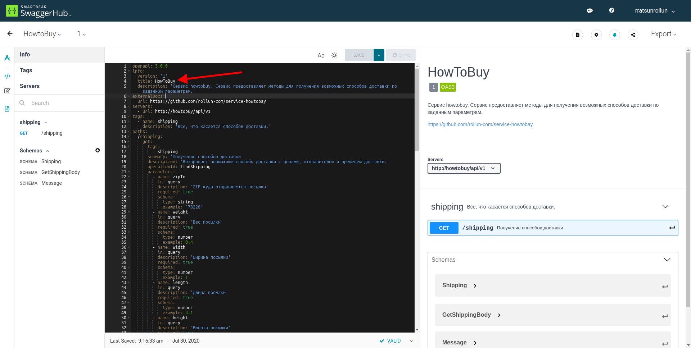
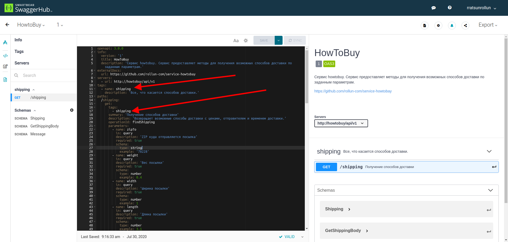
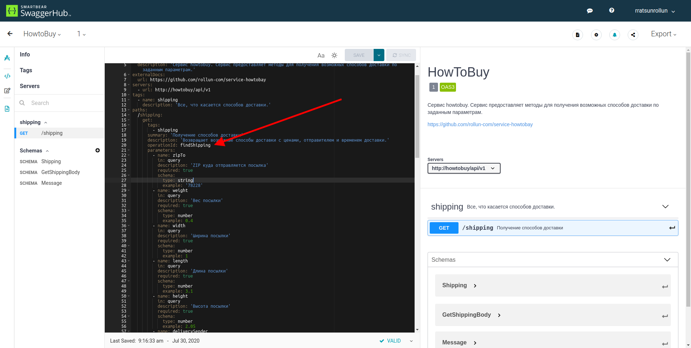
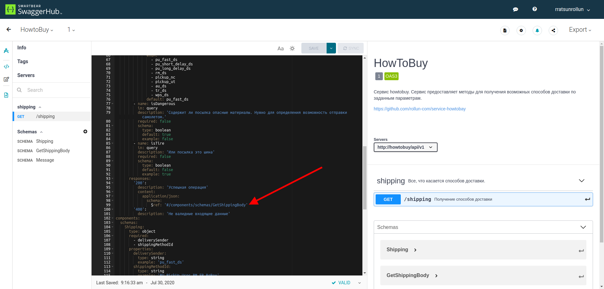

# Правила создание openapi манифеста
Генераторы заточены под версию openapi **3.0.0** по этому использование других версий не поддерживается.
Для ознакомления с документацией swagger (openapi) перейдите по [ссылке](https://swagger.io/docs/).   

## Блоки манифеста
Оpenapi манифеста разделен на логические блоки:
 * openapi - здесь нужно указать версию
 * info - здесь нужно указать общую информацию об апи. Например название, версию, описание и т.д.
 * servers - здесь нужно указать сервера (hosts) 
### info

3. **title** нужно указывать обязательно. Это должно быть одно слово (camelcase). Это поле используется генератором как имя модуля.
     
4. **version** нужно указывать обязательно. Это поле используется генератором для создания версии, для того чтобы можно было изолировать версии api.
   
5. **tags** нужно указывать обязательно. Теги используются для группирования методов.
      
6. **operationId** нужно указывать обязательно. Генератор создаст метод в **handler** с таким же именем. 
    
7. Очень важно в качество возвращаемых данных **всегда** указывать модель. Дело в том, что все методы которые что-либо возвращают, возвращают DTO объект. В случае если DTO объект не будет создан вами, генератор создаст его сам, например, Response200. А вот, если вы опишете модели сами и в манифесте будете только ссылаться на них, то генератор создаст DTO объекты с ваших моделей и не будет добавлять свои "непонятные" объекты.
   
   

#### Важно понимать при создании апи манифеста:
 * [API Server and Base URL](https://swagger.io/docs/specification/api-host-and-base-path/)   
